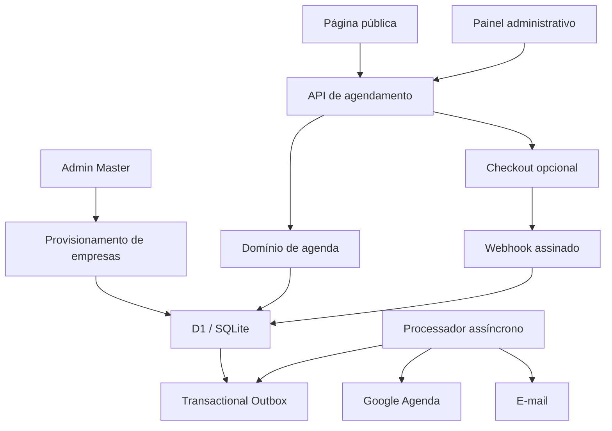

# Arquitetura — Agenda Livre

## 1. Decisão principal

O produto começa como um monólito modular. Interface, API e regras ficam no mesmo deploy, mas as fronteiras de domínio e os adaptadores externos permanecem separados. Isso reduz custo operacional no início e preserva uma evolução segura para filas ou serviços independentes quando o volume justificar.

## 2. Visão geral

## 3. Isolamento multiempresa

O sistema usa banco compartilhado e coluna obrigatória `tenant_id` nas entidades empresariais. Toda consulta administrativa combina:

1. identidade autenticada;
2. vínculo ativo em `tenant_members`;
3. filtro de `tenant_id` aplicado no servidor.

Esse desenho atende o MVP e mantém baixo custo. Para clientes que exijam isolamento físico, a mesma camada de repositório poderá selecionar um banco por empresa sem alterar o domínio.

### Hierarquia de autorização

A identidade e a autorização são deliberadamente separadas:

1. `users`: identidade interna, senha e estado da conta;
2. `auth_sessions`: sessões opacas armazenadas por hash;
3. `platform_admins`: autorização para operar o produto Agenda Livre;
4. `tenant_members`: autorização como proprietário, administrador ou equipe de uma empresa. Nunca concede acesso a outra empresa.

O navegador não fornece a identidade por cabeçalhos confiáveis. O servidor resolve `user_id` a partir do cookie de sessão e só então verifica `platform_admins` ou `tenant_members`.

O provisionamento do Admin Master grava empresa, proprietário, profissional inicial opcional e auditoria em um único `batch`. Arquivamento é lógico (`is_active = 0`), preservando profissionais, agenda, pagamentos e histórico. O Admin Master pode entrar em um painel empresarial para suporte, mas as consultas continuam obrigatoriamente filtradas pelo `tenant_id` selecionado.

## 4. Criação de agendamento

### Garantias

- O cabeçalho `Idempotency-Key` evita duplicidade causada por clique repetido ou retentativa de rede.
- Uma trigger no banco rejeita qualquer intervalo sobreposto para o mesmo profissional, considerando buffers.
- Agendas diferentes podem receber compromissos no mesmo instante.
- Triggers adicionais rejeitam vínculos entre profissionais, atividades e empresas diferentes.
- Agendamento e eventos de integração são persistidos no mesmo `batch`, que funciona como transação.
- O processador usa bloqueio lógico, número máximo de tentativas e backoff exponencial.
- Google, e-mail e pagamento possuem chaves próprias de idempotência.

## 5. Pagamento opcional

O compromisso é criado antes da tentativa de pagamento. Essa ordem é intencional:

- quem escolhe pagar no local conclui imediatamente;
- quem escolhe pagar online recebe checkout hospedado;
- se o provedor estiver indisponível, o horário continua confirmado e pode ser pago no atendimento;
- o webhook assinado muda `payment_status` para `paid` sem depender da página de retorno.

O domínio conhece somente `paymentPreference` e `paymentStatus`. O adaptador inicial usa Stripe Checkout e pode ser trocado por Mercado Pago sem reescrever a agenda.

## 6. Profissionais e relação N:N

`tenant_members` representa quem pode entrar no painel; `professionals` representa quem atende. A separação evita transformar todo atendente em usuário administrativo e permite que um gestor cuide de várias agendas.

`professional_services` vincula profissionais e atividades em N:N. O vínculo pode sobrescrever duração, preço e buffers da atividade para aquela pessoa. Ao reservar, a API resolve um profissional exato e salva no compromisso um snapshot dessas condições. Assim, alterações futuras no catálogo não reescrevem o passado.

Disponibilidade recorrente e compromissos sempre exigem `professional_id`. Bloqueios aceitam um profissional ou `NULL`: neste último caso, fecham toda a empresa. A escolha pública “qualquer profissional” agrega as agendas, remove horários duplicados e devolve uma pessoa já resolvida para a reserva.

## 7. Google Agenda

Cada profissional conecta sua própria agenda usando OAuth 2.0 com acesso offline. O refresh token:

- nunca vai para o navegador;
- é criptografado com AES-256-GCM antes de entrar no banco;
- pertence à combinação empresa + profissional;
- é consumido somente pelo processador assíncrono.

O evento é criado na agenda principal do profissional escolhido e o cliente entra como convidado. Um identificador derivado do agendamento reduz o risco de eventos duplicados.

## 8. Modelo de dados

| Entidade | Responsabilidade |
| --- | --- |
| `users` | Identidade interna, hash de senha e estado de acesso |
| `auth_sessions` | Sessões opacas; apenas o hash do token é persistido |
| `platform_admins` | Operadores autorizados a administrar a plataforma e suas empresas |
| `tenants` | Empresa, fuso, moeda e página pública |
| `tenant_members` | Usuários administrativos e papéis de acesso |
| `professionals` | Pessoas que prestam os atendimentos |
| `professional_services` | Relação N:N e sobrescritas por profissional |
| `services` | Atividade, duração, buffers e preço |
| `availability_rules` | Faixas recorrentes por profissional e dia da semana |
| `blocked_periods` | Férias, pausas individuais ou bloqueios da empresa |
| `appointments` | Reserva, profissional resolvido e snapshot comercial |
| `payments` | Estado financeiro e referência externa |
| `integration_connections` | Conexões externas criptografadas |
| `outbox_events` | Eventos duráveis a processar |
| `notification_deliveries` | Rastreamento por canal e destinatário |
| `idempotency_keys` | Respostas reutilizadas com segurança |
| `audit_log` | Alterações administrativas relevantes |

## 9. Evolução recomendada

1. Adicionar convite/ativação por e-mail para novos administradores e identidade SaaS externa.
2. Adicionar cancelamento e reagendamento pelo token público.
3. Programar lembretes de 24 horas e 2 horas.
4. Adicionar PIX e um adaptador Mercado Pago, se o público principal for Brasil.
5. Materializar disponibilidade somente se o volume tornar o cálculo sob demanda caro.
6. Migrar o processador para fila gerenciada quando o número de eventos justificar.
7. Adicionar testes de contrato dos adaptadores e ampliar cenários de carga concorrente.

Não é recomendado iniciar com microserviços. As integrações já estão assíncronas e desacopladas; separar deploys agora aumentaria observabilidade, custo e operação sem melhorar o domínio.
