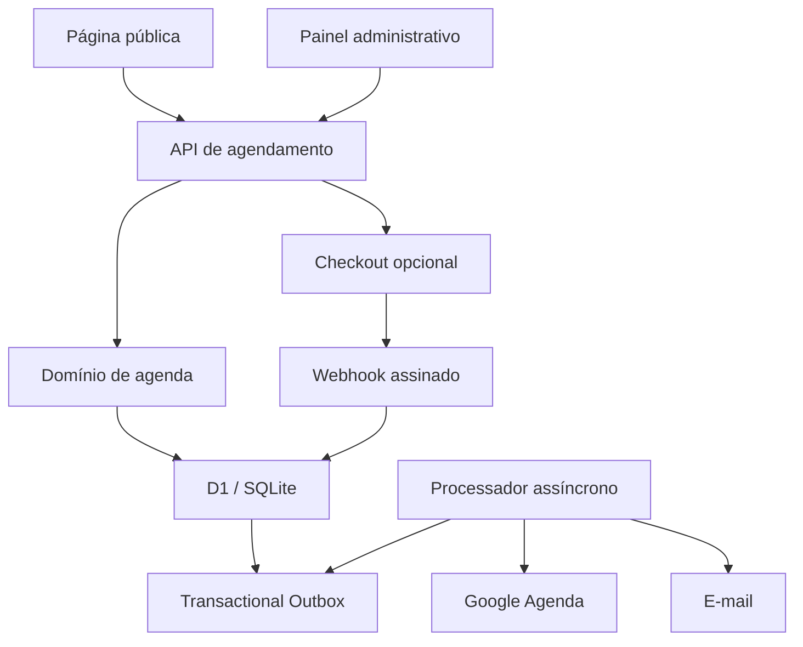
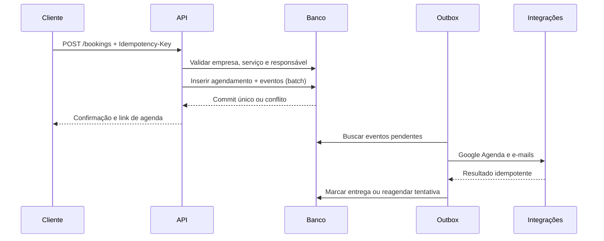

# Arquitetura — Agenda Livre

## 1. Decisão principal

O produto começa como um monólito modular. Interface, API e regras ficam no mesmo deploy, mas as fronteiras de domínio e os adaptadores externos permanecem separados. Isso reduz custo operacional no início e preserva uma evolução segura para filas ou serviços independentes quando o volume justificar.

## 2. Visão geral

## 3. Isolamento multiempresa

O sistema usa banco compartilhado e coluna obrigatória `tenant_id` nas entidades empresariais. Toda consulta administrativa combina:

1. identidade autenticada;
2. vínculo ativo em `tenant_members`;
3. filtro de `tenant_id` aplicado no servidor.

Esse desenho atende o MVP e mantém baixo custo. Para clientes que exijam isolamento físico, a mesma camada de repositório poderá selecionar um banco por empresa sem alterar o domínio.

## 4. Criação de agendamento

### Garantias

- O cabeçalho `Idempotency-Key` evita duplicidade causada por clique repetido ou retentativa de rede.
- Uma trigger no banco rejeita qualquer intervalo sobreposto para o mesmo responsável.
- Agendamento e eventos de integração são persistidos no mesmo `batch`, que funciona como transação.
- O processador usa bloqueio lógico, número máximo de tentativas e backoff exponencial.
- Google, e-mail e pagamento possuem chaves próprias de idempotência.

## 5. Pagamento opcional

O compromisso é criado antes da tentativa de pagamento. Essa ordem é intencional:

- quem escolhe pagar no local conclui imediatamente;
- quem escolhe pagar online recebe checkout hospedado;
- se o provedor estiver indisponível, o horário continua confirmado e pode ser pago no atendimento;
- o webhook assinado muda `payment_status` para `paid` sem depender da página de retorno.

O domínio conhece somente `paymentPreference` e `paymentStatus`. O adaptador inicial usa Stripe Checkout e pode ser trocado por Mercado Pago sem reescrever a agenda.

## 6. Google Agenda

Cada administrador conecta sua agenda usando OAuth 2.0 com acesso offline. O refresh token:

- nunca vai para o navegador;
- é criptografado com AES-256-GCM antes de entrar no banco;
- pertence a uma única empresa;
- é consumido somente pelo processador assíncrono.

O evento é criado na agenda principal do administrador e o cliente entra como convidado. Um identificador derivado do agendamento reduz o risco de eventos duplicados.

## 7. Modelo de dados

| Entidade | Responsabilidade |
| --- | --- |
| `tenants` | Empresa, fuso, moeda e página pública |
| `tenant_members` | Administradores e responsáveis |
| `services` | Atividade, duração, buffers e preço |
| `availability_rules` | Faixas recorrentes por dia da semana |
| `blocked_periods` | Férias, pausas e bloqueios manuais |
| `appointments` | Reserva e estado principal |
| `payments` | Estado financeiro e referência externa |
| `integration_connections` | Conexões externas criptografadas |
| `outbox_events` | Eventos duráveis a processar |
| `notification_deliveries` | Rastreamento por canal e destinatário |
| `idempotency_keys` | Respostas reutilizadas com segurança |
| `audit_log` | Alterações administrativas relevantes |

## 8. Evolução recomendada

1. Finalizar onboarding de novas empresas e identidade SaaS externa.
2. Adicionar cancelamento e reagendamento pelo token público.
3. Programar lembretes de 24 horas e 2 horas.
4. Adicionar PIX e um adaptador Mercado Pago, se o público principal for Brasil.
5. Materializar disponibilidade somente se o volume tornar o cálculo sob demanda caro.
6. Migrar o processador para fila gerenciada quando o número de eventos justificar.
7. Adicionar testes de contrato dos adaptadores e testes de concorrência no banco.

Não é recomendado iniciar com microserviços. As integrações já estão assíncronas e desacopladas; separar deploys agora aumentaria observabilidade, custo e operação sem melhorar o domínio.
